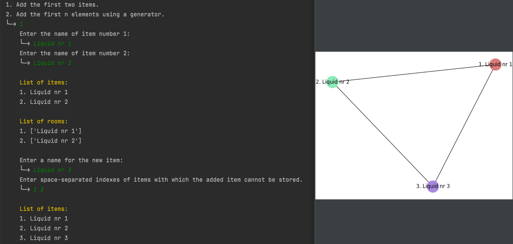
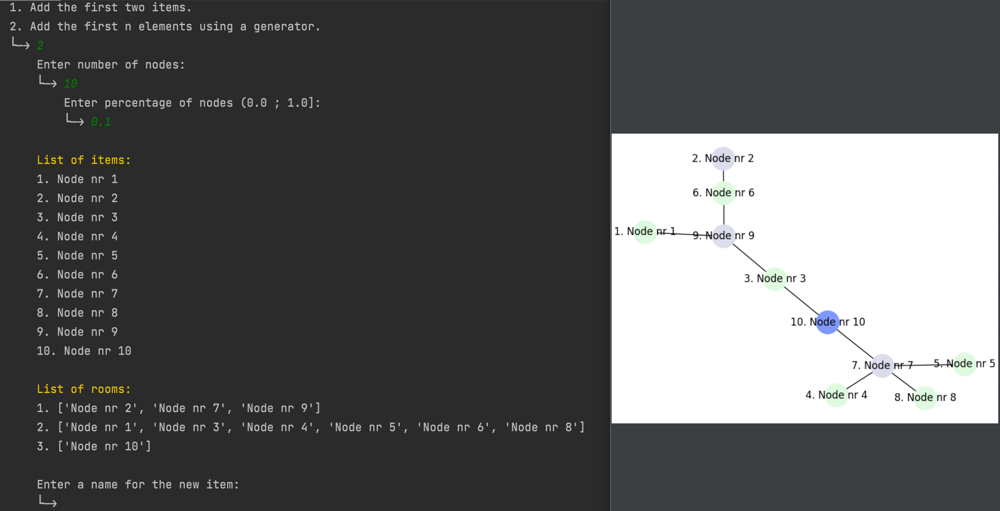
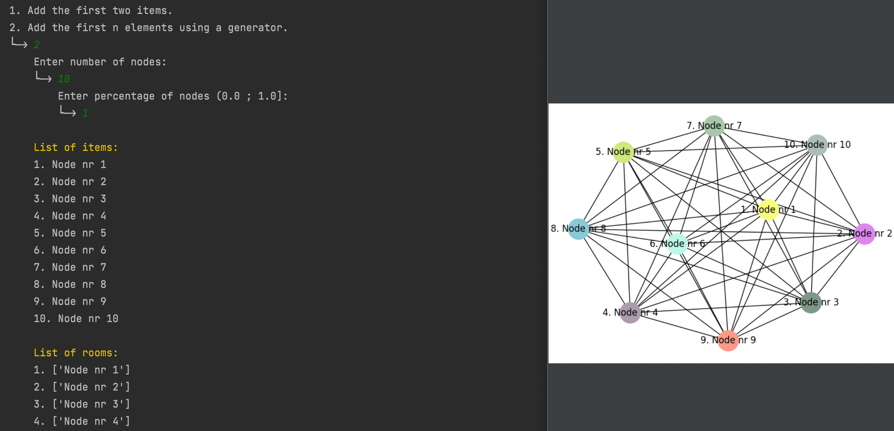

# Graph coloring

## Table of contents
* [General info](#general-info)
* [Examples of usage](#usage)

## General info
An application that colors graphs using an exact and heuristic algorithm with the ability to add new nodes.
	
## Usage
### Without using a generator

### Using a generator

